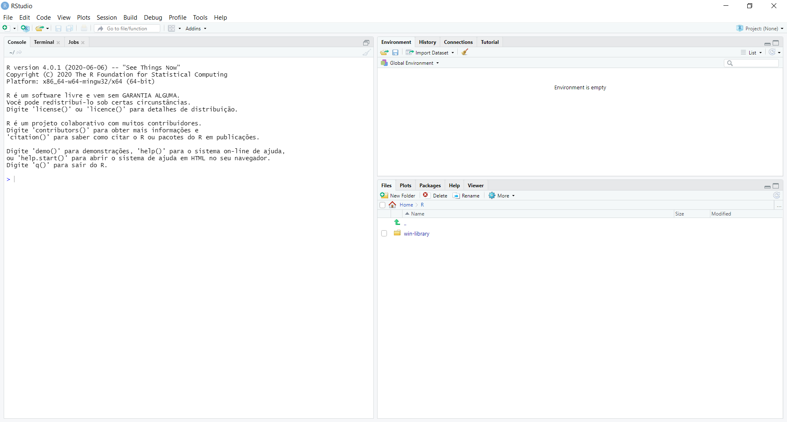
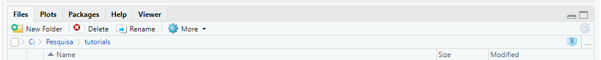
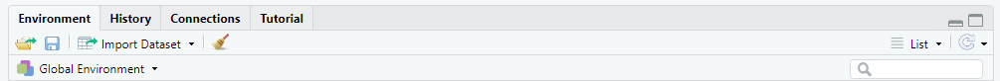
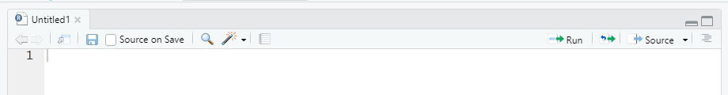
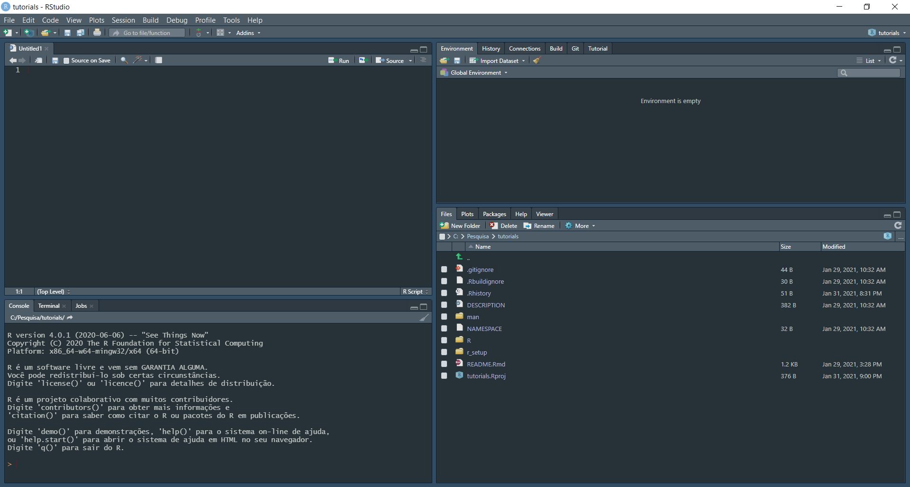
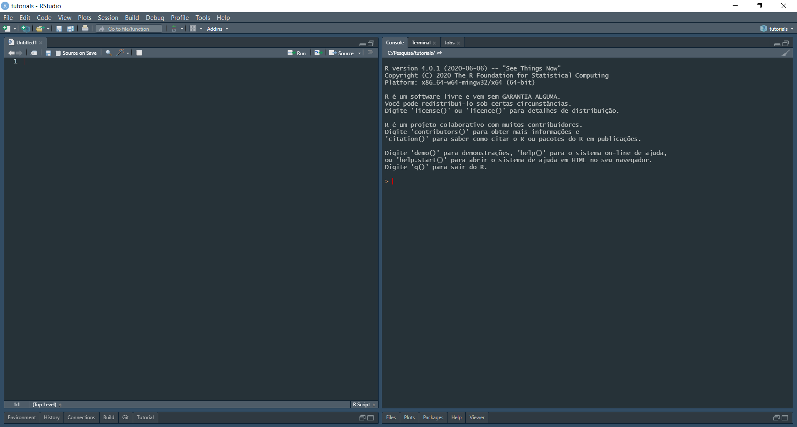
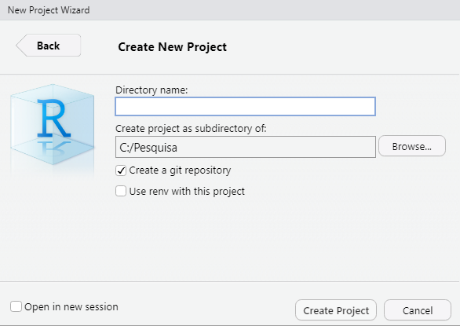

```{r setup, include=FALSE}
library(learnr)
knitr::opts_chunk$set(echo = FALSE)
```

## Introdução

Olá, tudo bem? Muito obrigado por dividir este tempo aqui comigo. Neste tutorial vamos começar do zero. Vou te mostrar como instalar as nossas ferramentas de trabalho e as functionalidades mais simples. Qualquer dúvida ou sugestão, sinta-se a vontade em entrar em contato comigo no samuelmacedo@recife.ifpe.edu.br.

### O que você aprenderá neste tutorial

Este tutorial foi desenvolvido para te dar o primeiro empurrão neste novo mundo da programação. Aqui você vai aprender:

- Instalar o R, Rstudio e Git;
- Entender os quatro painéis principais do Rstudio;
- Alterar cor e posição dos paineis do Rstudio;
- Criar um projeto;
- Criar um script básico;
- Mostrar alguns atalhos;
- Instalar bibliotecas e chamar algumas funções.

## Instalando as ferramentas

Nosso caminho começa instalando nossas ferramentas de trabalho: R, Rstudio e git.
Todas essas ferramentas são gratuitas. Só instalar e usar. Vamos por partes.

### Instalando o R

Não é difícil encontrar o R. Basta digitar "R" no seu navegador. Provavelmente será o primeiro link, para facilitar vou deixar [aqui](https://cran-r.c3sl.ufpr.br/) pra você. 


### Instalando o Rstudio

O R é base de tudo, o Rstudio será a nossa IDE (Integrated Development Environment). Entenda a IDE como uma interface "bonitinha" onde será muuuuuuito mais fácil trabalhar e criar nossas ferramentas, confie em mim. Lembre-se, como o Rstudio é uma interface em cima do R, o R deve ser instalado primeiro. O link para baixar o rstudio encontra-se [aqui](https://rstudio.com/products/rstudio/download/#download). Baixe a versão Desktop, a versão Server será num outro tutorial.

### Instalando o Git

O Git é uma ferramenta de versionamento de código. Com ela é possível:

- Salvar seus progressos por versão, ou seja, é super fácil voltar para uma versão estável quando a atual deu algum problema;
- Criar ramos (branch) de código sem alterar a versão principal;
- Fácil de compartilhar o códígo com outras pessoas;
- Possibilita propor modificações no código dos seus colegas e eles também podem sugerir modificações no seu código por meio de PR (pull request). 

Algumas pessoas vão dizer que não é fundamental usar o Git e elas estão corretas. Para aplicações pequenas com umas dezenas de linhas de código, de fato, não é necessário (apesar que uso pra tudo). Contudo, quando sua aplicação tiver centena de milhares de linhas de código, dezenas de arquivos e tiver outras pessoas alterando o código ao mesmo tempo...é impossível gerir isso tudo sem o Git. Você pode encontrar o Git [aqui](https://git-scm.com/downloads).

Depois que você instalar o Git, abra o Rstudio (se ele já estava aberto, feche abra novamente).

### Exercício

```{r question-r_install, echo=FALSE}
question("Em que ordem o R e Rstudio devem ser instalados?",
  answer("Primeiro o Rstudio e depois o R"),
  answer("Primeiro o R e depois o Rstudio", correct = TRUE),
  answer("Uma vez instalado o Rstudio, não é necessário instalar o R"),
  random_answer_order = TRUE,
  allow_retry = TRUE
)
```

## Conhecendo os painéis do Rstudio

Depois que estiver tudo instalado, está na hora de começar a conhecer a IDE do Rstudio. Quando abri-lo, você deve encontrar uma tela mais ou menos assim: 

<p align="center">

</p>

Perceba que existem 3 painéis abertos, vamos precisar abrir o quarto, mas é bem simples.
No canto superior esquerdo embaixo de "File", clique neste símbolo  e após selecione a opção "R Script". Outra opção também é utilizar o atalho Ctrl+Shift+N. Agora seu Rstudio deve estar parecido com a figura abaixo:

<p align="center">

</p>

### File/Plots/Packages/Help

Este painel encontra-se no lado direito inferior.


Na aba "Files" estarão os arquivos que estão na pasta prinicipal. Você pode navegar pelas pastas do seu computador clicando no símbolo de três pontos no final do painel. Também é possível criar pastas, deletar arquivos e renomear. Esta aba é útil, pois te dá a opção de uma interface para navegar pelo computador sem precisar sair do Rstudio.

A aba de "Plots" fica logo ao lado de "Files",  aqui serão mostrados os gráficos que você construir. Na aba "Packages" serão mostrados os pacotes que estão instalados na sua máquina.

A aba de "Help" é onde fica a documentação das funções do R. 

### Enviroment/History/Connections

Este painel contém todas as variáveis que foram salvas na aba "Environment". Na aba "History" você encontrará os últimos comandos que foram executados e me "Conections" estarão as conexões feitas a outros programas, por exemplo um database.

<p align="center">

</p>

### Console/Terminal

Na aba de "Console" está o R propriamente dito, todo o resto é a interface do Rstudio. É no console onde você deverá rodar os comandos. Na aba "Terminal" você poderá acessar o terminal do seu computador, seja ele Linux, Windows ou Mac. Esta aba é muito útil, pois é possível acessar o terminal sem precisar abrir outra tela.

<p align="center">

</p>

### Source

É aqui onde seus arquivos serão abertos e vocês escreverá seus códigos. De longe, é o onde você irá passar a maior parte do tempo. 

<p align="center">

</p>

### Exercícios

```{r question-help_panel, echo=FALSE}
question("Em que aba encontra-se a documentação de uma função?",
  answer("Viewer"),
  answer("Help", correct = TRUE),
  answer("Packages"),
  answer("Console"),
  random_answer_order = TRUE,
  allow_retry = TRUE
)
```

```{r question-r_script_shortcut2, echo=FALSE}
question("Qual o atalho para abrir um script em R?",
  answer("Ctrl+Shift+N", correct = TRUE),
  answer("Ctrl+Shift+M"),
  answer("Ctrl+Alt+N"),
  answer("Ctrl+Alt+M"),
  random_answer_order = TRUE,
  allow_retry = TRUE
)
```

## Deixando do seu jeito

Bem, o Rstudio será sua estação de trabalho. É nesta ferramenta onde você ficará ligado todo o tempo. No meu caso, no trabalho, é a primeira coisa ligo e a última que desligo...todos os dias (e às vezes nos fins de semanas). Enfim, o que quer dizer é que você precisa se sentir confortável nele. Vamos deixa-lo com a sua cara então :)

### Modificando a aparência

Não sei você, mas essa tela branca me dói a vista. Talvez você não sinta agora, mas pra mim que já estou nessa estrada a um pouco mais de 15 anos (e perto dos 40) é simplesmente inviável trabalhar assim. Se você, assim como eu, se incomoda também, vá em `Tools -> Global Options -> Appearence`. Escolha em "Editor theme" aquela opção que mais te agrada. 
Só pra exemplificar, eu uso o tema "Material" e fica dessa forma: 

<p align="center">
  
</p>

### Modificando os painéis de lugar

Todas os quatros painés são úteis, mas, pela minha experiência, os que mais você vai usar são "Source" e "Console". Apenas por uma questão de organização, eu prefiro por-los lado a lado e deixar "Environment" e "Files" embaixo minimizados. Assim ganho mais espaço em tela pra trabalhar no código. Não se preocupe que caso outra aba precise ser aberta, tipo "Environemnt", "Plots" ou "Help", o Rstudio mostra eles automaticamente. Caso queira trocar vá em `Tools -> Global Options -> Pane Layout`. Só pra exemplificar, meu layout fica desse jeito:

<p align="center">
  
</p>

### Exercício

```{r question-chaos_theme, echo=FALSE}
question("As cores no tema chaos são?",
  answer("Fundo preto, *function* em azul e *Plot* em verde", correct = TRUE),
  answer("Fundo cinza, *function* em rosa e *Plot* em branco"),
  answer("Fundo azul, *function* em branco e *Plot* em rosa"),
  answer("Fundo branco, *function* em preto e *Plot* em azul"),
  random_answer_order = TRUE,
  allow_retry = TRUE
)
```

## Criando um projeto

Um projeto nada mais é do que uma pasta. A grande vantagem de criar projetos é que, dessa forma, é mais fácil se organizar quando você estiver em mais de um trabalho ao mesmo tempo. Para criar um projeto vá em `File -> New Project`, aparecerá uma tela com essas três opções:

<p align="center">
  
</p>

"New Directory" irá criar um projeto do zero. "Existing Directory" é no caso de você querer transformar num projeto uma pasta que já foi criada. "Version Control" é quando você deseja criar um projeto advindo de um repositório já criado, por exemplo no github. Por agora, vamos criar um projeto novo. 

Vá em `File -> New Project -> New Directory -> New Project` e você encontrará está tela:

<p align="center">
  
</p>

Escolha o nome e a pasta que deseja salvar seu projeto. Lembra do Git que instalamos no início deste tutorial? Pois é, clique na opção "Create a git repository". Não se preocupe, eu vou fazer um tutorial só sobre Git num futuro próximo. 

Para exemplificar, eu criei um projeto chamado `tutorials`. Perceba que no painel de "File" foram criados dois arquivos: `.gitignore`e `tutorials.Rproj`. O primeiro é um arquivo do Git, por hora apenas saiba que ele existe, eu vou entrar mais a fundo no tutorial de Git. O `tutorials.Rproj` é seu arquivo de projeto, é nele que estão descritas algumas especificações, como por exemplo: a quantidade de espaços numa tabulação, se vai salvar histórico e workspace, entre outros.

Por fim, você percebeu que nome do projeto agora aparece na interface? No canto superior esquerdo agora aparece do lado símbolo do Rstudio o nome do seu projeto. No canto superior direito, também aparece o nome de seu projeto, mas também é um botão. Nele é possível mudar de projeto, criar novos apagar a lista e muito mais.

<p align="center">
  
</p>

```{r question-r_rproj, echo=FALSE}
question("Das opções abaixo, qual tag não existe assim que você cria um Rproj?",
  answer("RunProject", correct = TRUE),
  answer("Encoding"),
  answer("AlwaysSaveHistory"),
  answer("NumSpacesForTab"),
  random_answer_order = TRUE,
  allow_retry = TRUE
)
```


